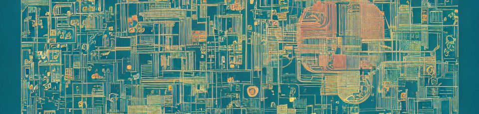

# Personal project -- presents zero value to anyone else, move along

This is a personal project, that serves some of my personal needs in working with some GPUs. I've hacked some wierdness together with zero consideration of maintainability. The only reason this project is in public access, is that so I can pull it from any of my random machines that may or may not have any credentials at all (exchept the deta project key in the environment).
